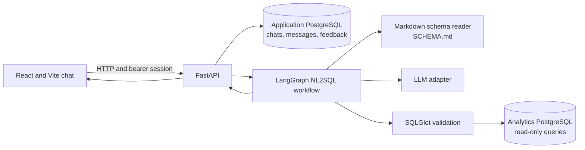
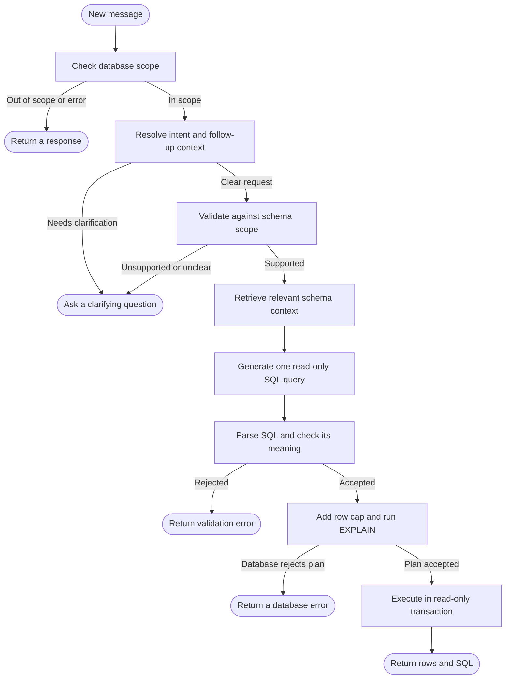

# Querydesk

Querydesk lets someone ask questions about a database in everyday language and see both the answer and the SQL behind it. The point is not to ask a model to guess at a database: the app reads a `SCHEMA.md`, narrows the relevant context, checks the request, validates the SQL, and only then runs it.

The interface is a chat. Follow-up messages stay in the same conversation, so “Show me all customers” followed by “only from California” can be understood as one continuing request. Results appear in a table, can be downloaded as CSV, and can be summarized on demand. Users can leave feedback on an answer.

## Getting started

You’ll need Docker Compose and a model API key. Gemini is the default provider. Compose starts both the API and the Vite frontend, so Node.js is only needed if you want to run the frontend outside Docker.

1. Copy `.env.example` to `.env`. Add your Gemini key as `GOOGLE_API_KEY` and replace the example application database password.
2. Start the complete app in the background:

   ```sh
   docker compose up --build -d
   ```

   Compose starts both databases, the API, and the frontend. On an empty analytics database volume, it loads the sample schema and rows from `db/init.sql` and `db/sample_data.sql`. The app is available at [http://localhost:5173](http://localhost:5173); the API listens on port `8000`.
3. To watch service logs:

   ```sh
   docker compose logs -f
   ```

Open the app and enter an email address. To stop the services, run `docker compose down`; this keeps the database volumes and saved chats.

The current sign-in is deliberately simple: an email identifies a chat space, and the API keeps short-lived bearer sessions in memory. It is not proof of identity—anyone who enters someone else’s email can see that email’s chats. Use it only for a trusted demo with non-sensitive data. After an API restart, sign in again with the same email to recover the same saved chats.

### Using a different model or host

The model connection is configured on the server. Gemini is the default (`MODEL_PROVIDER=google_genai`), using `GOOGLE_API_KEY`. For an OpenAI-compatible local service, configure it like this instead:

```env
MODEL_PROVIDER=openai-compatible
MODEL_NAME=system
MODEL_BASE_URL=http://host.docker.internal:1976/v1
MODEL_API_KEY=
```

Use the model ID your local service expects. From inside Docker, `127.0.0.1` points back to the API container, so use the host name your platform provides (for example, `host.docker.internal` on Docker Desktop). Keys and model settings stay on the server and are not sent to the browser.

### Using another database schema

Replace the root `SCHEMA.md` with a description of your database, then restart the API. Keep the format the schema reader understands: a dialect declaration, `### table_name` sections with Markdown column tables, and optional `## Relationships`, `## Business definitions`, and `## Global data rules and caveats` sections. The reader uses those descriptions to find relevant context; it does not inspect the database to fill in missing joins or business meanings. See [Architecture and workflow](docs/architecture.md#schema-reading-and-retrieval) for what is retrieved and how.

When Compose runs the frontend, set its browser-visible API address in the root `.env` as `VITE_API_URL`, and add the frontend origin to `CORS_ORIGINS`. For example, with the EC2 hostname used during setup:

```env
VITE_API_URL=http://ec2-13-63-175-127.eu-north-1.compute.amazonaws.com:8000
CORS_ORIGINS=http://ec2-13-63-175-127.eu-north-1.compute.amazonaws.com:5173
```

Rebuild/recreate the frontend and API after changing those values with `docker compose up --build -d`. For a public deployment, serve the app over HTTPS and replace the demo email sign-in with real authentication.

If you already have a database volume, the initialization scripts do not run again automatically. To apply the sample rows without removing that volume:

```sh
docker compose exec -T db psql -U nl2sql -d nl2sql_demo < db/sample_data.sql
```

## How the pieces fit together

The browser handles the chat experience: sending messages, showing tables, downloading CSV, copying SQL, switching themes, and collecting feedback. The FastAPI service owns the decisions that need to be trusted: it derives the current user from the session, loads chat history, runs the LangGraph pipeline, and stores each turn.

There are two PostgreSQL databases. The analytics database is where generated, read-only SQL runs. The application database holds conversations, messages, and feedback. Keeping those separate means the chat history does not share the analytics database’s tables or credentials.

The model is reached through a small adapter, so the rest of the pipeline does not need to know whether the configured provider is Gemini, Anthropic, or an OpenAI-compatible service. The schema reader follows a similar boundary: it turns `SCHEMA.md` into table descriptions and retrieves the pieces that appear relevant to a question.



The detailed architecture and graph behavior are in [Architecture and workflow](docs/architecture.md). The prompts sent to the model are collected in [Prompts](docs/prompts.md).

## The LangGraph workflow

Each message moves through a graph with explicit stops. A request that is unrelated to the database ends early. An ambiguous or unsupported request gets a clarification and suggested alternatives instead of SQL. Only a request that passes scope checks reaches SQL generation.



The graph’s nodes and branches are explained in [Architecture and workflow](docs/architecture.md). Prompt wording is documented in [Prompts](docs/prompts.md).

## A few important limits

Schema retrieval is lexical: it scores table names, column names, and words in each table description, then includes the strongest matches. This keeps large schemas from being sent wholesale to the model, but a well-written `SCHEMA.md` still matters. It should explain table grain, relationships, business terms, and data caveats. The reader does not inspect the live database to discover those rules.

SQLGlot checks that the result is a single read-only query and only refers to documented tables. A separate model call checks whether the query appears to answer the request. That semantic check is a useful guardrail, not a proof. Before execution, the app adds a result cap, asks PostgreSQL to `EXPLAIN` the query, and then runs it in a read-only transaction with a statement timeout.

The query result limit defaults to 500 rows and the statement timeout to 8 seconds. For a deployment with real data, use a database role with only `SELECT` privileges, enable HTTPS, and replace the demo sign-in.
