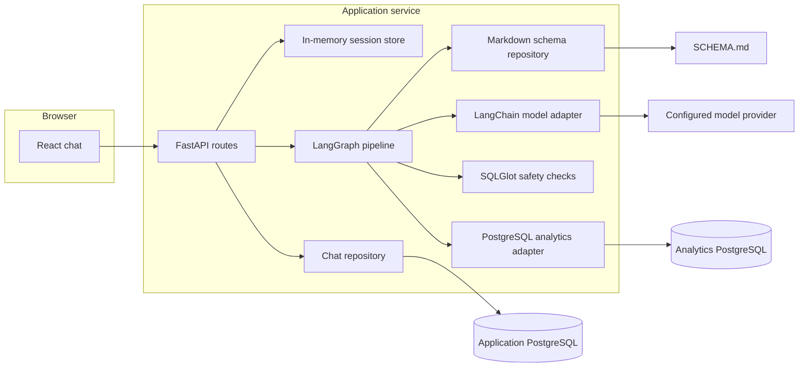

# Architecture and workflow

Querydesk is built around a simple idea: let a model interpret a question, but keep the path from that interpretation to database execution visible and constrained. The model does not connect to PostgreSQL. The API supplies context to the model, checks what comes back, and only then asks the analytics database to run SQL.

## The request from browser to database

The React/Vite app sends each turn to FastAPI with a bearer session. The API gets the user identity from that session, loads that user’s recent messages, and invokes the query pipeline. It stores the user message before the model or database work starts, then stores the assistant response and query result. This means an accepted question remains in chat history even if a later model or database call fails.

The pipeline is assembled as a LangGraph `StateGraph`. Its state carries the current wording, a standalone interpretation of the question, recent history, intent, selected scope, schema context, generated SQL, validation status, and—after execution—the returned columns and rows. Each node returns updates to that shared state, including a list of stages that the UI can show.

The backend defines interfaces for sessions, chat storage, the model, schema access, analytics queries, and the pipeline. Concrete adapters provide in-memory sessions, PostgreSQL persistence and execution, Markdown schema reading, and a LangChain-backed model connection. This keeps provider or storage choices behind small boundaries instead of spreading them through the query workflow.

## What each graph step does

1. **Request check.** The model decides whether the message belongs to this database, with a small schema preview and recent chat. An unrelated request ends here. Short or invalid input is also stopped early.
2. **Intent detection.** The model identifies the analytical intent and turns a follow-up into a standalone request. For example, “only from California” is combined with the previous customer query. If the wording is ambiguous or the requested concept is not represented in the schema, the graph returns a clarifying question and possible alternatives.
3. **Scope validation.** The model checks that the standalone request can be answered from the available schema. The application also rejects table names the schema reader does not know. An unsupported table or column is not silently invented.
4. **Schema retrieval.** The reader scores table descriptions against the request’s words and the table hints from intent detection. It returns the best matching table sections, plus relevant relationship rows, business definitions, and global data rules. It does not send every table to the model on every call.
5. **SQL generation.** The model receives the standalone request, the latest wording, intent, relevant conversation history, and retrieved schema context. It is asked for one read-only query in the configured SQL dialect.
6. **SQL validation.** SQLGlot parses the query. The application rejects multiple statements, write operations, row locks, `SELECT INTO`, and references to tables that are absent from the schema. A separate model call then compares the SQL with the question’s filters, metrics, grouping, and time meaning. Either check can stop the graph.
7. **SQL optimization.** “Optimization” here is intentionally modest: if the query has no limit, a row cap is added. The SQL is parsed again, then PostgreSQL runs `EXPLAIN` in a read-only transaction with a timeout. This catches invalid columns, joins, or database-specific syntax before fetching rows.
8. **Execution.** The validated query runs in another read-only transaction with the same timeout. The app fetches one more than the configured result limit so it can tell the UI whether the table was truncated.

Any check that fails ends the path before execution. Errors are returned as chat responses rather than allowing an invalid query to continue through later graph steps.

## Schema reading and retrieval

`SCHEMA.md` is the contract between the database and the model. The reader expects a dialect declaration, table sections headed by `### table_name`, Markdown column tables, and optional sections for relationships, business definitions, and global rules. Table purpose and row grain are useful context even though the SQL still has to use the real column names.

Retrieval uses word overlap, with extra weight for explicit table hints and column-name matches. Early checks include a few likely tables; later steps retrieve more detail. The default retrieval limit is eight table sections. Relationship and definition rows are scored separately, so a relevant join path or business rule can be included without adding the whole document to the prompt.

This is a lightweight retrieval method, not database introspection or embedding search. It scales better than pasting the entire schema into every prompt, but descriptions and exact identifiers in `SCHEMA.md` need to be accurate. The SQL validator uses the table names in that file as an allowlist; it does not independently discover missing business rules.

## Model boundary and prompts

Every model call goes through one configured adapter. The adapter supports Gemini, Anthropic, OpenAI-compatible chat APIs, and LangChain providers that have their integration package installed. Keys stay on the server. Classification and validation calls ask for JSON; SQL generation asks for SQL only. The exact system instructions and a description of the user context sent with each call are in [Prompts](prompts.md).

The semantic SQL check is a second model judgment, not a formal equivalence checker. SQLGlot can establish that a query parses and obeys structural rules; it cannot prove that a model understood “revenue,” “active customer,” or a time phrase the way the user intended. That is why the schema should explain those terms and why ambiguous requests pause for clarification.

## Chat ownership and persistence

The application database stores `conversation`, `messages`, and `feedback`. Each row has a `user_id`; composite foreign keys also make sure a message and its feedback belong to the same user as their parent record. The API scopes reads and writes by the ID in the current session, not an ID supplied with a chat request.

The current email sign-in is only a demo identity mechanism. A normalized email maps to a stable user ID, while random bearer tokens are kept in a process-local session store for 24 hours. The messages and chats survive restarts in PostgreSQL, but sessions do not. There is no password or email verification, so an email address is not proof of identity. Do not put sensitive or production data behind this sign-in.

## Query boundaries

Three checks work together before SQL runs: SQLGlot enforces query shape and known tables, the semantic model call checks whether the query matches the request, and PostgreSQL `EXPLAIN` checks the query against the live database. Execution is read-only and time-limited, and the returned rows are capped.

For a real deployment, also use a dedicated database role with only `SELECT` privileges, put the app behind HTTPS, replace the email-only sign-in, and keep the analytics and application database credentials separate.
