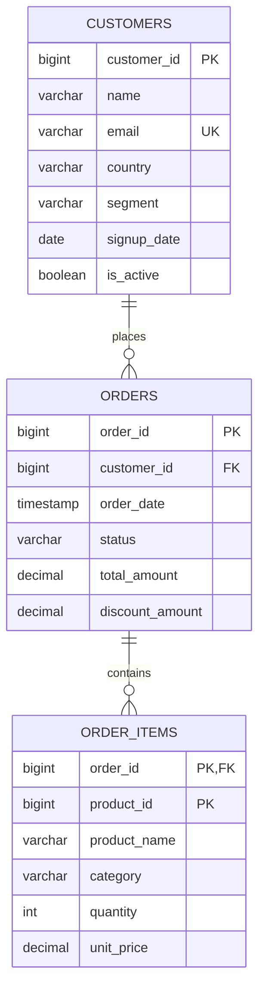
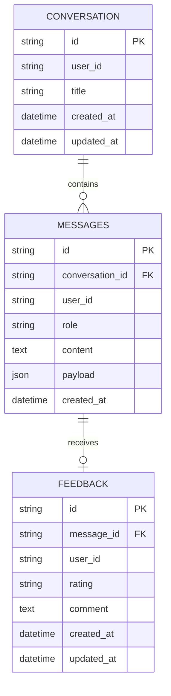

# The database behind the demo

Querydesk currently connects to two PostgreSQL databases. They serve different purposes, and generated NL2SQL queries run only against the analytics database.

## Analytics data: customers and orders

The demo analytics database is named `nl2sql_demo` and uses PostgreSQL. It models a straightforward sales workflow: customers place orders, and each order can contain multiple product line items. The sample tables are created by `db/init.sql`; example data is loaded from `db/sample_data.sql` when Docker initializes a fresh database volume.

`customers` has one row per customer. `orders` has one row per order and points to the customer who placed it. `order_items` has one row per product in an order; its primary key is the pair `(order_id, product_id)`. An order may have no items, and a customer may have no orders. To connect customers to products, join through `orders` rather than joining customers directly to `order_items`.

## Business meaning matters

The schema is deliberately small, but several business rules change what a correct answer means:

- Revenue is the sum of `orders.total_amount` for orders with status `CONFIRMED`, `SHIPPED`, or `DELIVERED`. Pending and cancelled orders are excluded.
- Product sales value is `quantity * unit_price` summed over eligible order items. It can differ from order totals because order discounts are not apportioned to products.
- For product units sold, sum `order_items.quantity` for items in eligible orders.
- Joining orders to items repeats each order once per item. Use `COUNT(DISTINCT orders.order_id)` for order counts after that join, and avoid summing order totals across duplicated rows.
- `orders.total_amount` is the canonical order total, in USD. It includes applicable discounts; tax and shipping are not separate columns.
- `customers.country` is the customer's registered country. There is no state or order-destination column, so a request specifically about a US state cannot be answered from this schema.
- Inactive customers can still have historical orders. Do not exclude them unless the question asks for active customers.

These definitions live in the root `SCHEMA.md`. The model uses them when writing SQL, and they help the system ask for clarification when a request cannot be represented by the available columns.

## Chat and feedback storage

The second PostgreSQL database is `querydesk_app`. It is for the application, not for analytics. The API creates these tables on startup:

Each conversation belongs to a user. Messages are attached to a conversation and carry the same `user_id`; feedback belongs to an assistant message and its user. The database enforces those ownership relationships with composite foreign keys. A down-vote requires a comment, while an up-vote can be left without one. Query results and generated SQL are kept in the message's JSON payload so the chat can be restored later.

The current sign-in asks for an email but does not verify it. The app derives a stable user ID from the normalized email and stores bearer sessions in memory. Chat rows persist in `querydesk_app`, but the sign-in is only suitable for a trusted demo: someone can enter another person's email and access that person's chats.

## What “NL2SQL” means here

NL2SQL is the path from an everyday-language question to a database query. For example, a person might ask, “Which product categories sold the most units last quarter?” Querydesk checks that the request concerns this database, retrieves the relevant table and business definitions from `SCHEMA.md`, asks the configured model to write SQL, validates that SQL, and only then runs it against `nl2sql_demo`. The result comes back as a table with the SQL shown alongside it.

The application database is outside that path. The model is not given access to chat tables, and user questions cannot query conversations or feedback. For a fuller explanation of retrieval and the safeguards before execution, see [Architecture and workflow](architecture.md).
